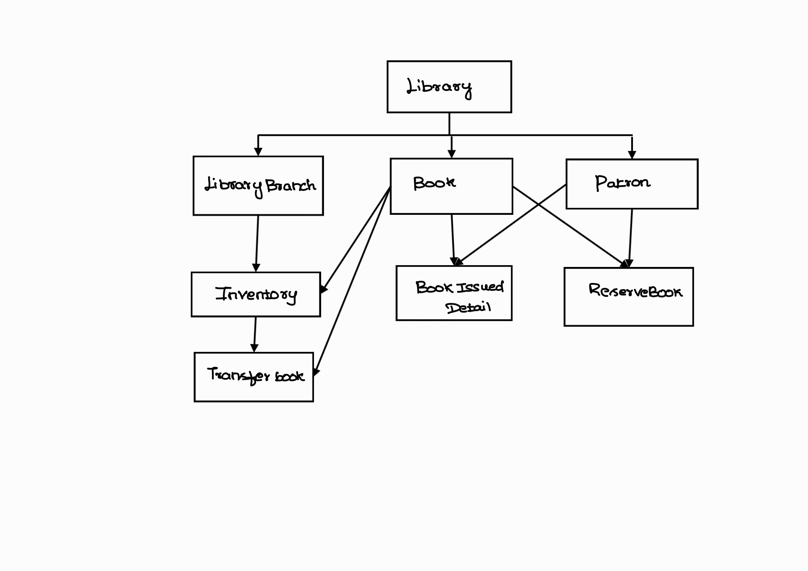

# LibraryManagementPackage.Library-Management-System

This project is a simple Library Management System implemented in Java.
It supports managing books, patrons, reservations, book transfers between branches, inventory tracking, and fine
calculation for late returns.

## Features

- **Library**: The main class that manages the library system, including books, patrons, and borrowed history.
- **LibraryBranch**: Represents a branch of the library, allowing for book transfers between branches.
- **Inventory**: Manages the inventory of books in the library, including adding and transferring books.
- **Book**: Represents a book in the library, with attributes like title, author, ISBN, genre, and publication year.
- **Patron**: Represents a library patron, with attributes like name, ID, borrowed books, and contact information.
- **BookIssuedDetail**: Contains details about the book issued to a patron, including issue date, due date, and return
  date.
- **ReserveBook**: Represents a reservation made by a patron for a book, including reservation date and status.
- **TransferBook**: Represents a book transfer between library branches, including transfer date and status.
- **BookRecommendation**: Provides book recommendations to patrons based on their borrowing history.
- **FineCalculator**: Calculates fines for late book returns based on the number of overdue days.
- **BookTransfer**: Manages the transfer of books between library branches, including initiating and completing
  transfers.

## Relationships

- Inheritance: The `LibraryBranch` class extends the `Library` class, inheriting its properties and methods.
- Composition: The `Library` class contains instances of `Book`, `Patron`, `BookIssuedDetail`, `ReserveBook`, and
  `TransferBook`.
- Aggregation: The `Library` class aggregates `Inventory`, which manages the books in the library.
- Association: The `Book` class is associated with the `Patron` class through the `BookIssuedDetail` class, which tracks
  the borrowing history of books.`ReserveBook` is associated with `Patron` and `Book`, allowing patrons to reserve
  books.`TransferBook` is associated with `LibraryBranch` and `Book`, allowing for book transfers between branches.
  `Inventory`
  associates with `LibraryBranch` and `Book`, allowing for inventory management across branches.

## Class Diagram

Below is a UML-style class diagram showing the main classes and their relationships:

This diagram and description provide an overview of the system's structure and relationships.